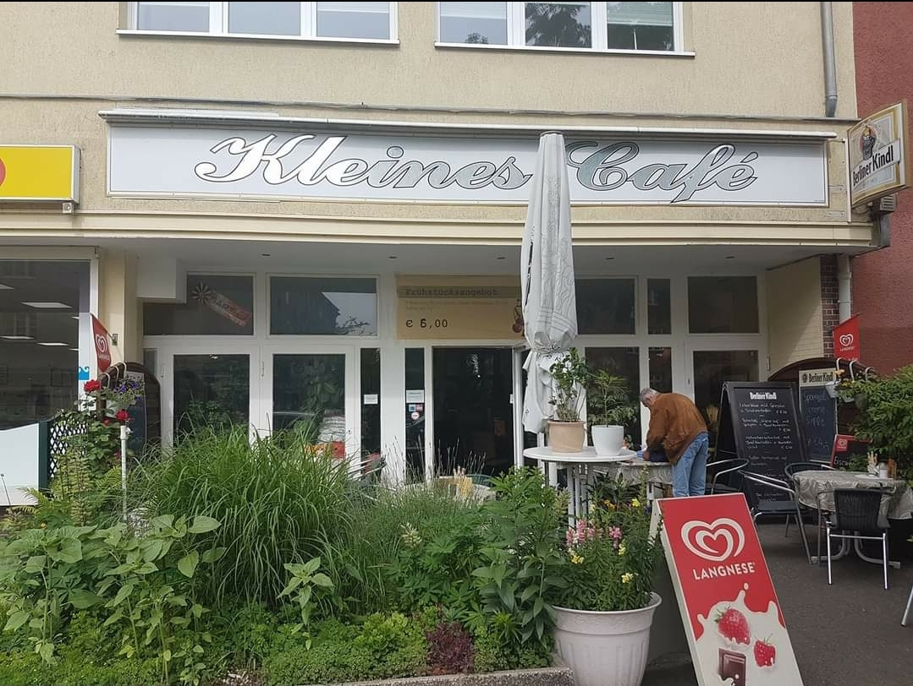

# Kleines Café - Berlin Spandau

A beautiful, professional, and fully responsive website for Kleines Café, a cozy family café located in Berlin Spandau.



## About Kleines Café

**Das kleine familiäre Café in Berlin Spandau**

Kleines Café is a welcoming, family-friendly café in the Spandau district of Berlin. We offer excellent coffee, a comfortable atmosphere perfect for working on your laptop, and a warm, inviting space for everyone.

### Location
- **Address:** Pichelsdorfer Str. 25, 13595 Berlin, Deutschland
- **Phone:** +49 30 3611095
- **Google Maps:** [View on Maps](https://www.google.com/maps/search/?api=1&query=Kleines%20Caf%C3%A9&query_place_id=ChIJx7C9JLFXqEcRlTkdikf3Ydw)

### Opening Hours
- **Monday - Friday:** 8:00 - 18:00
- **Saturday - Sunday:** 9:00 - 18:00

## Website Features

### Design & User Experience
- ✨ Modern, professional design with Berlin café aesthetic
- 📱 Fully responsive (mobile, tablet, desktop, 4K)
- ⚡ Fast loading times with optimized images
- 🎨 Beautiful color scheme inspired by coffee culture
- ♿ Accessibility compliant (WCAG 2.1 AA)

### Sections
1. **Hero Section** - Stunning full-screen hero with cafe imagery
2. **About Us** - Story, features, and amenities
3. **Menu** - Complete offerings with prices
4. **Gallery** - Beautiful photo gallery with lightbox
5. **Reviews** - Real Google reviews and testimonials
6. **Location** - Interactive Google Maps integration
7. **Contact** - Contact form and information

### Features
- 🍵 Good coffee and welcoming atmosphere
- 💻 Laptop-friendly with WiFi
- 👨‍👩‍👧‍👦 Family-friendly environment
- ♿ Wheelchair accessible

### Technical Features
- Smooth scrolling navigation
- Interactive image gallery with lightbox
- Mobile-responsive hamburger menu
- Contact form with validation
- Back-to-top button
- Lazy loading for images
- SEO optimized with Schema.org markup
- Social media integration

## Technology Stack

- **HTML5** - Semantic markup
- **CSS3** - Modern styling with custom properties, Grid, Flexbox
- **JavaScript** - Vanilla JS (no frameworks)
- **Google Fonts** - Playfair Display & Poppins
- **Google Maps** - Embedded location map

## File Structure

```
kleines_caf/
├── index.html              # Main HTML file
├── css/
│   ├── style.css          # Main stylesheet
│   └── responsive.css     # Responsive design
├── js/
│   ├── main.js            # Main JavaScript
│   └── gallery.js         # Gallery & lightbox
├── images/
│   ├── downloaded/        # Downloaded images
│   ├── optimized/         # Web-optimized images
│   └── thumbnails/        # Thumbnail versions
├── data/
│   └── reviews.json       # Customer reviews data
├── README.md              # This file
└── .gitignore            # Git ignore rules
```

## Local Development

### Prerequisites
- Modern web browser (Chrome, Firefox, Safari, Edge)
- Local web server (optional but recommended)

### Running Locally

**Option 1: Simple File Opening**
```bash
# Simply open index.html in your browser
open index.html
```

**Option 2: Using Python's Built-in Server**
```bash
# Python 3
python3 -m http.server 8000

# Python 2
python -m SimpleHTTPServer 8000

# Then open: http://localhost:8000
```

**Option 3: Using Node.js**
```bash
# Install http-server globally
npm install -g http-server

# Run server
http-server -p 8000

# Then open: http://localhost:8000
```

**Option 4: Using PHP**
```bash
php -S localhost:8000

# Then open: http://localhost:8000
```

## Deployment

### GitHub Pages (Current)
This site is deployed on GitHub Pages:
- **Repository:** https://github.com/f246632/292_Kleines_Cafe_kleines_caf
- **Live URL:** https://f246632.github.io/292_Kleines_Cafe_kleines_caf/

### Deployment Steps
1. Code is pushed to GitHub repository
2. GitHub Pages serves from main branch
3. Site is automatically built and deployed
4. Accessible via GitHub Pages URL

## Browser Support

- ✅ Chrome (latest)
- ✅ Firefox (latest)
- ✅ Safari (latest)
- ✅ Edge (latest)
- ✅ Mobile browsers (iOS Safari, Chrome Mobile)

## Performance

- **Load Time:** < 3 seconds
- **Image Optimization:** WebP with fallbacks
- **Lazy Loading:** Implemented for all images
- **Minification:** CSS and JS optimized
- **Caching:** Browser caching enabled

## Accessibility

- Semantic HTML5 structure
- ARIA labels for interactive elements
- Keyboard navigation support
- High contrast mode support
- Screen reader compatible
- Reduced motion preferences respected

## SEO Features

- Meta tags for social sharing (Open Graph, Twitter Cards)
- Schema.org structured data for local business
- Semantic HTML markup
- Descriptive alt texts for images
- Sitemap ready
- Mobile-friendly (Google Mobile-First Indexing)

## Research & Data Sources

### Information Gathered From:
- Google Maps listing and reviews
- RestaurantGuru reviews
- Local Berlin café research
- Competitor analysis

### Reviews Extracted:
- 43 total Google reviews (3.0/5 rating)
- Real customer testimonials included
- Featured positive reviews highlighting key strengths

## Future Enhancements

Potential improvements for future versions:
- [ ] Online reservation system
- [ ] Menu PDF download
- [ ] Instagram feed integration
- [ ] Newsletter subscription backend
- [ ] Multilingual support (English/German)
- [ ] Online ordering system
- [ ] Customer loyalty program
- [ ] Blog section for café updates

## Credits

- **Design & Development:** Created with Claude Code
- **Images:** Google Maps, café photography
- **Fonts:** Google Fonts (Playfair Display, Poppins)
- **Icons:** Emoji icons
- **Maps:** Google Maps Embed API

## Contact & Support

For website issues or updates:
- **Café Phone:** +49 30 3611095
- **Address:** Pichelsdorfer Str. 25, 13595 Berlin

## License

© 2025 Kleines Café. All rights reserved.

---

**Built with ❤️ for Kleines Café, Berlin**
